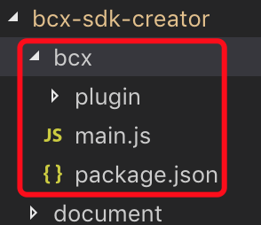
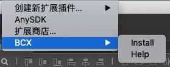
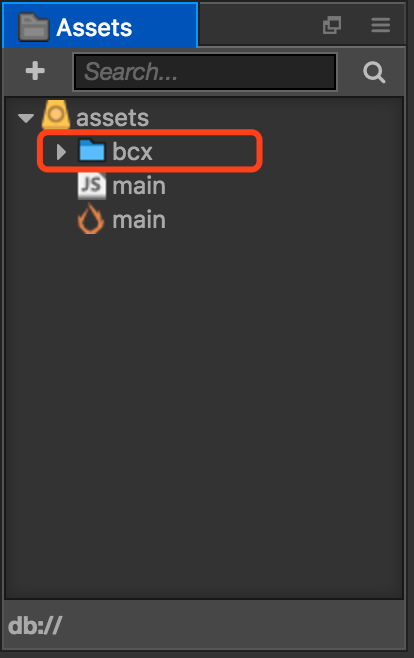

[中文](https://github.com/Cocos-BCX/bcx-sdk-creator/blob/master/readme.cn.md "中文")

# Cocos-BCX For Cocos Creator

## Introduction

1. [Cocos-BCX](https://www.cocosbcx.io/): The platform for the next generation of game digital economy, hereinafter referred to as BCX.
2. [Cocos Creator](https://cocos2d-x.org/creator): A set of integrated tools for game development with the core of content creation.

This project provides the users with workable BCX For Cocos Creator plugin, as well as a sample project of BCX which is connected to Cocos-Creator.

## Project Structure

`bcx` : Plugin package of BCX For Cocos Creator.(Directly use it by installing this file into the 'package')

`sample` : This is the sample project, with the basic method of calling BCX contained.

## Configuration Requirements for BCX For Cocos Creator

CocosCreator 2.0+

## The Use of BCX For Cocos Creator Plugin

* Put `bcx` file in 'packages' directory of Creator project.
* •	Once a plugin is installed, you can find the menu below in Creator

* •	Click `Install`, and `bcx` file will be generated in  assets directory
* •	Close and reopen the project, and `bcx` file will appear under `assets` 

* Now you can call relative interfaces of bcx in your own code.

## Sample description of  the project

* •	For Mac, directly open `sample/bcx-creator` with CocosCreator 2.0+ to operate the sample project.
* •	For Win, please delete `sample/bcx-creator/packages/bcx` first, and copy the `bcx` file (under the root directory)  to `sample/bcx-creator/packages/` ,then open it with CocosCreator 2.0+  to operate it.

## Matched Version

| BCX For Creator | BCX JS SDK |
| --------------- | ---------- |
| 0.0.1           | 1.3.0.2    |

As mentioned in the first line above, BCX For Creator 0.0.1 is generated based on BCX JS SDK 1.3.0.2.
